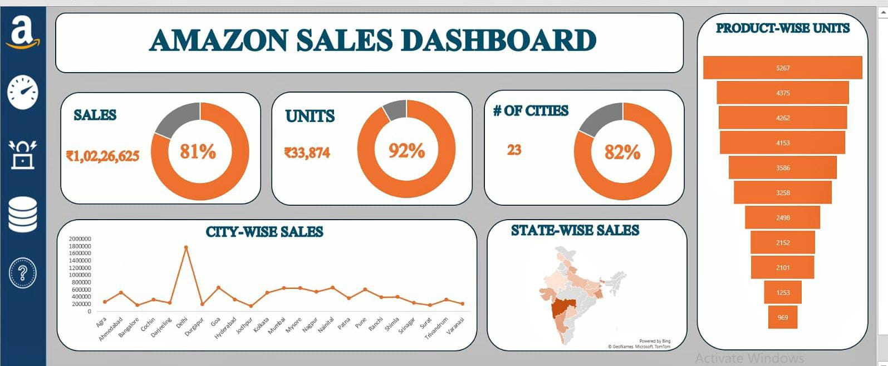

## 📌 Amazon Sales Excel Dashboard- Project
### 🎯 Project Objectives
* *Analyzed ₹1.02 Cr revenue and 33,874 units across 23 cities to evaluate sales distribution, product contribution, and regional penetration.*
* *Identified top-performing cities/states and high-demand products using KPI tracking (81% Sales, 92% Units, 82% Coverage).*
* *Designed a business-focused dashboard to transform raw data into strategic insights.*

### 🛠  Tools & Methods Used
* *Built using **Microsoft Excel (Pivot Tables, Pivot Charts, Slicers, KPI Cards, Conditional Formatting, State Heat Map).***
* *Applied aggregation (SUM), ranking, percentage contribution, and geographic segmentation (City & State analysis).*
* *Structured dashboard using visual storytelling and performance comparison techniques.*

### 📊 Key Dashboard Features

→ KPI Cards highlighting ₹1,02,26,625 total sales, 33,874 units, and 23-city coverage.           
→ Product-wise unit distribution with highest product at 5,267 units and lowest at 969 units.    
→ City-wise trend analysis and state-wise heat mapping for geographic performance evaluation.

## Excel Dashboard

  

###  Concepts Applied

* *KPI performance measurement and comparative sales analytics.*
* *Geographic sales mapping and product demand segmentation.*
* *Business Intelligence reporting with dynamic dashboard structuring and visualization principles.*

 ### 📈 Revenue & Units Insights

→ Revenue concentration observed in major metro cities with noticeable regional variability.     
→ Achieved 92% unit KPI performance, indicating strong sales efficiency.                     
→ Demand heavily concentrated among top 3 products, revealing product skewness.

### 📈 Geographic & Product Findings

* *Strong performance in Western and Southern regions, while certain states show lower penetration.*
* *One city displays a significant sales spike in trend analysis.*
* *Product distribution imbalance suggests scope for diversification and expansion.*

### 🏆 Outcomes & Achievements

✔ Identified high-performing regions and top-selling products through KPI-driven evaluation.     
✔ Measured sales coverage efficiency across 23 cities with clear visual representation.             
✔ Converted raw transactional data into structured strategic insights.

### 🏪 Business Improvements Suggested
* *Focus marketing and expansion efforts on underperforming states.*
*  *Increase inventory allocation for top-performing products.*
*  *Optimize regional product mix and implement targeted promotional strategies.*

### 📊 Project Impact & Value
* *Enabled data-driven decision-making, supporting expansion planning and inventory forecasting.*
* *Demonstrates strong Excel BI capability and advanced dashboard storytelling skills.*
* *Stands out through multi-level segmentation (Product + City + State) and KPI-focused design.*

__________________________________Developed by RAMESH SABHAVATH 👨🏼‍💻

